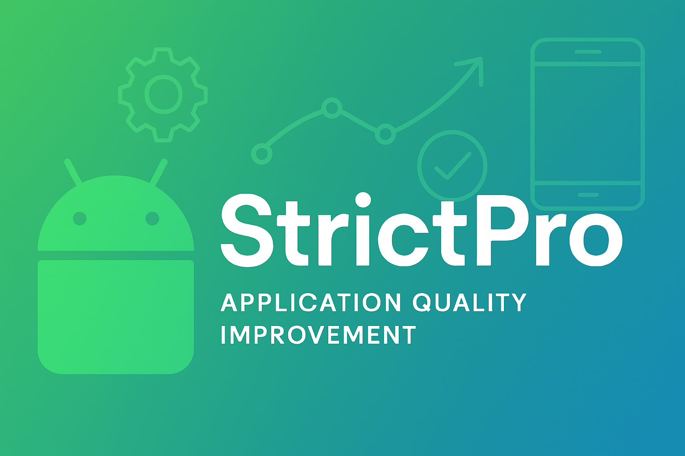
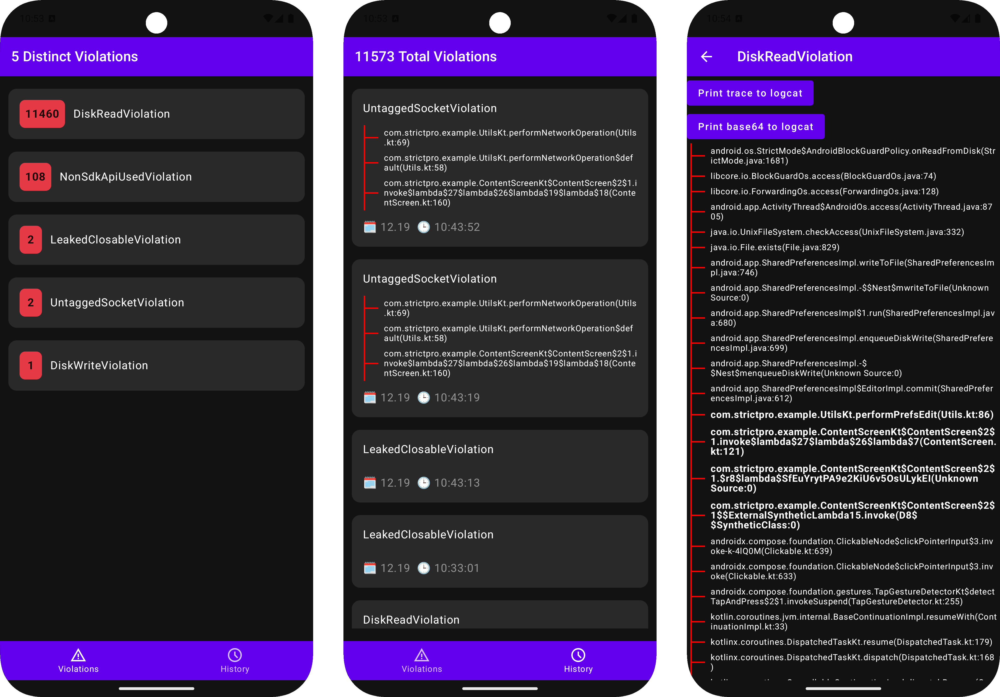
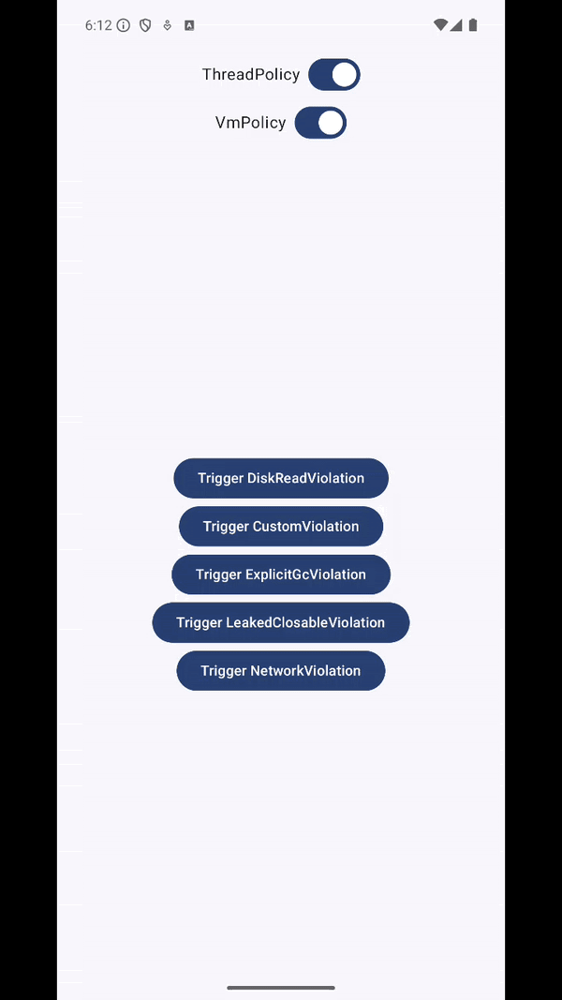

<h1 align="center">StrictPro 🚀</h1>
<br>

**StrictPro** is a powerful library designed to extend and improve Android's [StrictMode](https://developer.android.com/reference/android/os/StrictMode.html) by offering more flexibility and informative UI for violations. It addresses some of the common limitations developers face with StrictMode.



## Why Use StrictPro? 🤔

StrictMode is an important tool for catching common mistakes in Android development. However, developers often encounter the following issues:

- 🚫 **False positives**: Violations that are detected but not actionable.
- 🔄 **Compatibility issues**: Some StrictMode configurations require specific Android API versions, leading to unnecessary boilerplate code.
- 📉 **No UI representation**: Limited visibility of violations makes debugging harder.

StrictPro solves these problems by providing a flexible wrapper around StrictMode, adding more advanced features, and enhancing its capabilities.

## Installation 🛠️

Add StrictPro to your project by including the following in your `build.gradle.kts` file:

```kotlin
android {
    compileSdk = 35
    defaultConfig {
        targetSdk = 35
        minSdk = 21 // Required minimum API is 21
    }
}

dependencies {    
    val libVersion = "1.0.0"
    debugImplementation("com.github.tberchanov.StrictPro:strictpro:$libVersion")
    releaseImplementation("com.github.tberchanov.StrictPro:strictpro.stubs:$libVersion")
}
```

Ensure the JitPack repository is declared in your `settings.gradle.kts`:
```kotlin
dependencyResolutionManagement {
    repositories {
        maven { url = uri("https://jitpack.io") }
    }
}
```

`strictpro.stubs` library contains empty implementation of the public library interface. Additionally, it is not containing 3rd party dependencies, so consumer app will not get transitive dependencies, which may impact the app size.

It is recommended to use `strictpro.stubs` for production builds.

Usage Example 💻
------
In your `MainApplication.kt`, you can configure StrictPro with customizable penalties:
```kotlin
class MainApplication: Application() {

    override fun onCreate() {
        StrictPro.setVmPolicy(
            StrictPro.VmPolicy.Builder()
                .detectAll()
                .penaltyLog()
                .penaltyDialog()
                .penaltyFlashScreen()
                .setWhiteList {
                    // Defines penalty for the violation by substring in stack. Do nothing on violation if penalty is null.
                    contains("some substring in stack", null)
                    // Defines penalty for the violation by base64 encoded stack.
                    base64("base64 encoded stack trace", ViolationPenalty.Ignore)
                    base64("another base64 encoded stack trace", ViolationPenalty.Dialog)
                    // Custom logic to define penalty for the violation. Do nothing on violation if penalty is null.
                    condition { violation ->
                        // some custom logic
                        ViolationPenalty.FlashScreen
                    }
                }
                .build(),
        )
        StrictPro.setThreadPolicy(
            StrictPro.ThreadPolicy.Builder()
                .detectAll()
                .detectExplicitGc() // Call requires API level 34 or higher, otherwise it will be ignored.
                .penaltyLog()
                .penaltyDialog()
                .penaltyFlashScreen()
                .setWhiteList {
                    // Defines penalty for the violation by substring in stack. Do nothing on violation if penalty is null.
                    contains("some substring in stack", null)
                    // Defines penalty for the violation by base64 encoded stack.
                    base64("base64 encoded stack trace", ViolationPenalty.Ignore)
                    base64("another base64 encoded stack trace", ViolationPenalty.Dialog)
                    // Custom logic to define penalty for the violation. Do nothing on violation if penalty is null.
                    condition { violation ->
                        // some custom logic
                        ViolationPenalty.FlashScreen
                    }
                }
                .build(),
        )
    }
}
```

StrictProUI ✨
------

StrictProUI is the additional library that displays all StrictMode violations happened in your application.



There are the ways to open StrictProUI:
- Use shortcut that appears on long press on you application launcher icon. 
- Click StrictPro launcher icon with the same icon as your application. 
- Programatically open `StrictProUiActivity` from your application dev settings.

To setup StrictProUI:
```kotlin
dependencies {    
    val libVersion = "1.0.0"
    debugImplementation("com.github.tberchanov.StrictPro:strictpro.ui:$libVersion")
    releaseImplementation("com.github.tberchanov.StrictPro:strictpro.ui.stubs:$libVersion")
}
```

Sample `app` 📱
------
Run the sample `app` to trigger StrictMode violations and explore StrictPro’s features.



Future plans / TODO ⏳:
---

* Add dialog rate limiting (trottling).

* Add timing and other metadata to the DropBox penalty log.

* Implement more penalties executors: NotificationPenaltyExecutor, ToastPenaltyExecutor, VibrationPenaltyExecutor, SoundPenaltyExecutor.

* StrictPro UI, add import/export violations feature.

Useful Resources 📚
---
Learn more about StrictMode and its uses:

* https://medium.com/wizeline-mobile/raising-the-bar-with-android-strictmode-7042d8a9e67b

* https://medium.com/mobile-app-development-publication/android-strict-mode-selective-code-suppression-37ee0d999f6b#.kszw12gs1

* https://medium.com/mobile-app-development-publication/walk-through-hell-with-android-strictmode-7e8605168032

* https://elye-project.medium.com/hell-level-4-unleashed-by-android-strict-mode-dare-you-challenge-it-1dc9048bb4fb

* https://firebase.blog/posts/2017/07/find-more-bugs-using-strictmode-with/

## License 📜

This project is licensed under the [MIT License](LICENSE).