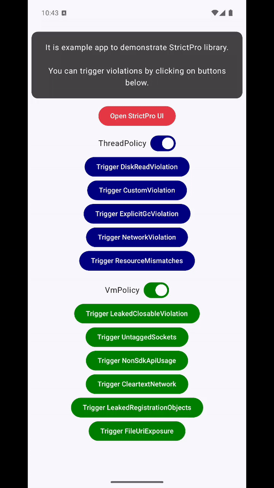

<h1 align="center">StrictPro 🚀</h1>
</br>

**StrictPro** is a powerful library designed to extend and improve Android's [StrictMode](https://developer.android.com/reference/android/os/StrictMode.html) by offering more flexibility, better error handling, and enhanced UI for violations. It addresses some of the common limitations developers face with StrictMode.

## Why Use StrictPro? 🤔

StrictMode is an important tool for catching common mistakes in Android development. However, developers often encounter the following issues:

- 🚫 **False positives**: Violations that are detected but not actionable.
- 🔄 **Compatibility issues**: Some StrictMode configurations require specific Android API versions, leading to unnecessary boilerplate code.
- 📉 **No UI representation**: Limited visibility of violations makes debugging harder.

StrictPro solves these problems by providing a flexible wrapper around StrictMode, adding more advanced features, and enhancing its capabilities.

## Installation 🛠️

Add StrictPro to your project by including the following in your `build.gradle.kts` file:

```kotlin
android {
    defaultConfig {
        minSdk = 21 // Required minimum API is 21
    }
}

dependencies {    
    implementation("com.github.tberchanov:StrictPro:0.0.2")
}
```

Ensure the following in your `settings.gradle.kts`:
```kotlin
dependencyResolutionManagement {
    repositories {
        maven { url = uri("https://jitpack.io") }
    }
}
```

Usage Example 💻
------
In your `MainApplication.kt`, you can configure StrictPro with customizable penalties:
```kotlin
class MainApplication: Application() {

    override fun onCreate() {
        StrictPro.setVmPolicy(
            StrictPro.VmPolicy.Builder()
                .detectAll()
                .penaltyLog()
                .penaltyDialog()
                .penaltyFlashScreen()
                .setWhiteList {
                    // Defines penalty for the violation by substring in stack. Do nothing on violation if penalty is null.
                    contains("some substring in stack", null)
                    // Defines penalty for the violation by base64 encoded stack.
                    base64("base64 encoded stack trace", ViolationPenalty.Ignore)
                    base64("another base64 encoded stack trace", ViolationPenalty.Dialog)
                    // Custom logic to define penalty for the violation. Do nothing on violation if penalty is null.
                    condition { violation ->
                        // some custom logic
                        ViolationPenalty.FlashScreen
                    }
                }
                .build(),
        )
        StrictPro.setThreadPolicy(
            StrictPro.ThreadPolicy.Builder()
                .detectAll()
                .detectExplicitGc() // Call requires API level 34
                .penaltyLog()
                .penaltyDialog()
                .penaltyFlashScreen()
                .setWhiteList {
                    // Defines penalty for the violation by substring in stack. Do nothing on violation if penalty is null.
                    contains("some substring in stack", null)
                    // Defines penalty for the violation by base64 encoded stack.
                    base64("base64 encoded stack trace", ViolationPenalty.Ignore)
                    base64("another base64 encoded stack trace", ViolationPenalty.Dialog)
                    // Custom logic to define penalty for the violation. Do nothing on violation if penalty is null.
                    condition { violation ->
                        // some custom logic
                        ViolationPenalty.FlashScreen
                    }
                }
                .build(),
        )
    }
}
```

Run the sample `app` to trigger StrictMode violations and explore StrictPro’s features.



Future plans / TODO ⏳:
---

* Add dialog rate limiting (trottling).

* Add timing and other metadata to the DropBox penalty log.

* Implement more penalties executors: NotificationPenaltyExecutor, ToastPenaltyExecutor, VibrationPenaltyExecutor, SoundPenaltyExecutor.

* Add screen with UI about StrictMode penalties.

Useful Resources 📚
---
Learn more about StrictMode and its uses:

* https://medium.com/wizeline-mobile/raising-the-bar-with-android-strictmode-7042d8a9e67b

* https://medium.com/mobile-app-development-publication/android-strict-mode-selective-code-suppression-37ee0d999f6b#.kszw12gs1

* https://medium.com/mobile-app-development-publication/walk-through-hell-with-android-strictmode-7e8605168032

* https://elye-project.medium.com/hell-level-4-unleashed-by-android-strict-mode-dare-you-challenge-it-1dc9048bb4fb

* https://firebase.blog/posts/2017/07/find-more-bugs-using-strictmode-with/

## License 📜

This project is licensed under the [MIT License](LICENSE).